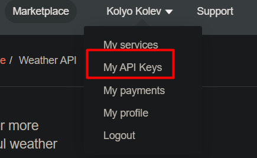

# Simple weather app with React

## Summary

This is a simple application inspired by
<a href="https://www.youtube.com/channel/UCBBGM84ZOs7z5jpTQAaZ_Hg" target="_blank">Tyler Potts'</a>
educational <a href="https://www.youtube.com/watch?v=GuA0_Z1llYU" target="_blank">video</a>

The API for fetching real time data used is provided by <a href="https://openweathermap.org/" target="_blank">OpenWeather</a>.

The full documentation for this particular API could be found <a href="https://openweathermap.org/current" target="_blank">here</a>

## Setup

- Clone the project;
- In the root directory: `run npm install` command in order to download the general dependencies;

## Steps to obtain a personal API Key

- Create account (if you don't have one) in the <a href="https://openweathermap.org/" target="_blank">OpenWeather</a>
- Navigate to the My API Keys option in the top bar drop down menu:

  </img>

- Choose either the default / already available key or create a new one;
- Rename `.evn_sample` file to `.env`;
- Inside the `.env` file replace the value of the `REACT_APP_WEATHER_APP_KEY` with your newly created API key;
- Save the file;
- Start (or restart if it has been started before) the react server via `npm start`;
